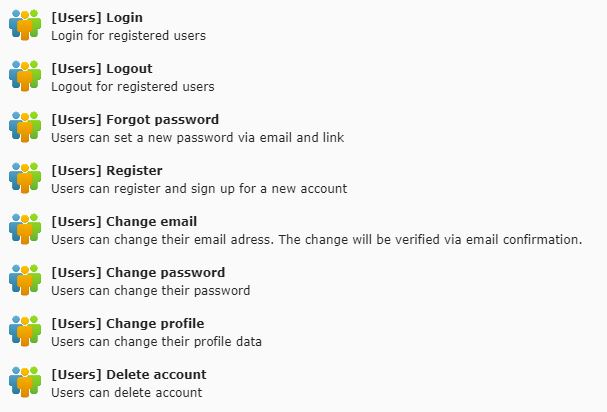

# TYPO3 users

Find on 

* TER: https://extensions.typo3.org/extension/users/
* Packagist: https://packagist.org/packages/saschaende/users
    * ```composer require saschaende/users```

With the extension "users" you get all necessary plugins to build up a community or a protected user area without complicated TYPOSCRIPT. All essential adjustments are made comfortably directly in the plugins. The adaptation is easily done via FLUID templates and is already based on Bootstrap 4. The "users" extension is maintained regularly, errors are fixed within a few days and new functions are added regularly.

# Features of the "users" Extension

## General

* User friendly, no complicated typoscript: You can configure all settings via the plugins
* FLUID templates, based on bootstrap 4, easy to customize. Even for emails.
* Security:
    * According to https://typo3.org/security/advisory/typo3-psa-2019-002/, Username and Email Address Enumeration is not possible in all plugins. If a user registers with an email, that exists, the email adress automatically gets a remember mail with an password reset link. (Thanks to Vasyl from http://typo3.net.ua/)
    * A list of 2160 disposable email address providers is included and can be imported with one click.
* Helpful multi Site support:
     * Saves root page uid for every registered user
     * Saves language setting of every user (on registration and every login, configurable)
* Language files delivered: 
    * German
    * English
    * Ukrainian
    
Offical support (fee-based) via https://filmmusic.io/imprint/   
        
## Plugins & Modules
    
* Login
    * Login with username AND/OR email
    * Configurable input fields
    * Save login count for every user
* Logout (so the user can logout just with a click on this page)
* Forgot password
* Change email (for registered users, with confirmation of the new adress via email)
* Change password (for registered users)
* Register
    * Set user groups that will be automatically assigned
    * Protect your system from disposable email addresses: Banlist for not allowed domains/hosts (spamschlucker ...)
* Module: Admin tool for importing newest spam host list (will be regularily updated)

# Credits / Other contributors

* Thanks to Vasyl from http://typo3.net.ua/
    * Commits by Vasyl: https://github.com/saschaende/typo3-users/commits?author=typo3ua

# Planned / ToDo

Here you can see what we are currently working on and what is still planned:
https://github.com/saschaende/typo3-users/projects
    
# Important notes

* Very important: Do NOT activate "Also allow login with email adress" in the "[Users] Login" plugin, if your system allows usernames with email adresses. The register plugin of this users extension will not allow email adresses as usernames.
* This extension does not allow multiple accounts with the same email address. It is also not planned to allow this.
* To display the icons in the forms, you need "fontawesome" - get it here: https://fontawesome.com/start
    * If you dont want fontawesome, you can configure the icon classes in TYPOSCRIPT and set "iconsInTheForms" to 0 or 1    

# Installation

## Preparation: Include static TypoScript
The extension ships some TypoScript code which needs to be included.

* Switch to the root page of your site.
* Switch to the Template module and select Info/Modify.
* Press the link Edit the whole template record and switch to the tab Includes.
* Select "Users (users)" at the field Include static (from extensions)
* If you have multiple websites configured, repeat the steps above for every website

## General

* Go to any page
* Click on "add content element"
* Switch to the tab "Users"
* Choose a plugin (login, register, ...) and insert it



* Edit the plugin (pencil)
* Edit the settings in the "plugin" tab (see the screenshots here in the documentation)
* Thats it and that's how every "users" plugin works
* No further typoscript

# Add plugins and configure your community

## Publicly accessible plugins

### Plugin: Login

Here users log in with their access data. Normally the username or the e-mail address and the password are used. The plugin supports login with username AND e-mail. For this reason, no e-mail addresses are allowed as user names.

* Add a new page "Login"
* **The page must be publicly accessible.**
* Insert plugin "[Users] Login"
* Click on the pencil icon
* Edit plugin settings

### Plugin: Forgot password

If a user has forgotten his password, he can request an e-mail with a link here using his user name or e-mail address. Afterwards, the user can assign a new password by clicking on the e-mail. If the account has not yet been activated, this action will automatically activate it.

* Add a new page "Forgot password"
* **The page must be publicly accessible.**
* Insert plugin "[Users] Login"
* Click on the pencil icon
* Edit plugin settings

### Plugin: Register

Here a user can register and create an account. The email address is automatically matched against a database of spam hosts. If the user enters an e-mail address that already exists, he will receive a link to assign a new password, as we can assume that the user has forgotten this.

* Add a new page "Register now"
* **The page must be publicly accessible.**
* Insert plugin "[Users] Register"
* Click on the pencil icon
* Edit plugin settings

## Protected userarea plugins

### Plugin: Logout

The Logout Plugin is used to integrate a simple logout via the main navigation. In the plugin a forwarding to a page after the logout can be defined. No other content should be created on the page with the Logout Plugin.

* Add a new page "Logout"
* **The page may only be accessed by logged in users.**
* Insert plugin "[Users] Logout"
* Click on the pencil icon
* Edit plugin settings

### Plugin: Change email

With this plugin the user can view his current e-mail address and request a change: The user receives an e-mail with a confirmation link. If the user clicks on the link in the e-mail, the new e-mail address is activated.

#### The form (user area)

* Add a new page "My email adress"
* **The page may only be accessed by logged in users.**
* Insert plugin "[Users] Change email"
* Click on the pencil icon
* Edit plugin settings

#### The confirmation page, when a user clicks on the link in the email (public area)

* Add a new page "Confirm email"
* Make the page invisible
* **The page must be publicly accessible.**
* Insert plugin "[Users] Change email (CONFIRM)"
* Thats it, there are no further settings

### Plugin: Change password

Here the user can change his password. The change is immediately active.

* Add a new page "My password"
* **The page may only be accessed by logged in users.**
* Insert plugin "[Users] Change password"
* Click on the pencil icon
* Edit plugin settings

### Plugin: Change profile

Here the user can change the username or other profile data. The change is immediately active.

* Add a new page "My profile"
* **The page may only be accessed by logged in users.**
* Insert plugin "[Users] Change profile"
* Click on the pencil icon
* Edit plugin settings

### Plugin: Delete account

With this plugin the user can delete his account: The user receives an e-mail with a confirmation link. If the user clicks on the link in the e-mail, the account will be deleted immediately.

#### The form (user area)

* Add a new page "Delete account"
* **The page may only be accessed by logged in users.**
* Insert plugin "[Users] Delete account"
* Click on the pencil icon
* Edit plugin settings

#### The confirmation page, when a user clicks on the link in the email (public area)

* Add a new page "Delete account"
* Make the page invisible
* **The page must be publicly accessible.**
* Insert plugin "[Users] Delete account (CONFIRM)"
* Thats it, there are no further settings