# TYPO3 users

Users brings you all essential plugins (login, logout, register, forgot password, banlist for spam hosts...) to build a community with your TYPO3 system. Based on easy to customize fluid templates. The extension will be available for TYPO3 9 as soon as the development of all plugins is finished.

## Features of the "Users" Extension

* User friendly, no complicated typoscript: You can configure all settings via the plugins
* Templates based on bootstrap 4
* FLUID templates, easy to customize. Even for emails.
* A list of 2160 disposable email address providers is included and can be imported with one click.
* Plugin: Login
    * Login with username AND/OR email
    * Configurable input fields
    * Save login count for every user
* Plugin: Logout
* Plugin: Forgot password
* Plugin: Register
    * Set user groups that will be automatically assigned
    * Protect your system from disposable email addresses: Banlist for not allowed domains/hosts (spamschlucker ...)
* Module: Admin tool for importing newest spam host list (will be regularily updated)
* Multi Site:
    * Saves root page uid for every registered user
* Saves language setting of every user
* Language files delivered: German / English

## Actually in development (coming soon)

* Security fix "register" plugin according to https://typo3.org/security/advisory/typo3-psa-2019-002/:
    * The user gets no feedback, if the email exists. If email exists, the user gets an email with password reset link. The rest of the input will be ignored. 

## Planned / ToDo

* Plugin: Change password
* Plugin: Change profile data
* Plugin: Change email (with verficiation of new email)
* Command: Scheduler to remove not activated users
* Module/Command: Newsletter / bulk sending with scheduler
* Signals
* Additional options for user names:
    * Setting A: Show input field and automatically generate a user name if the user does not enter one.
    * Setting B: Hide input field and always automatically generate a user name.
    * Setting C: User name is not generated automatically, input is mandatory.

## Why only for TYPO3 8?

I actually develop this extension in an 8 environment and will make it compatible to 9 after that.

## Demos

### Login

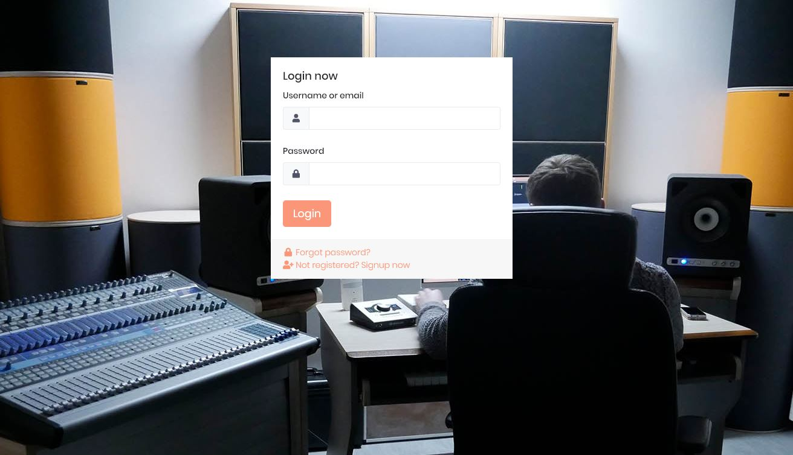

### Forgot password

### Register

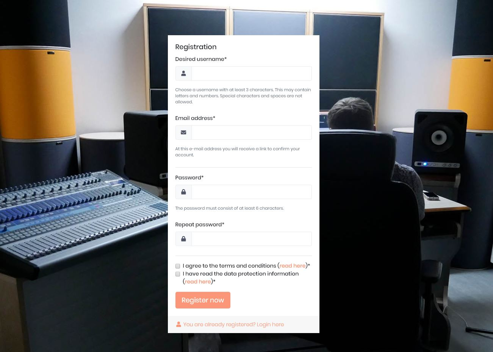

### Admin

Admin Module
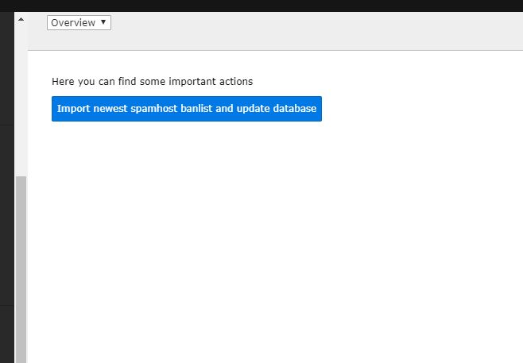

Banned Hosts
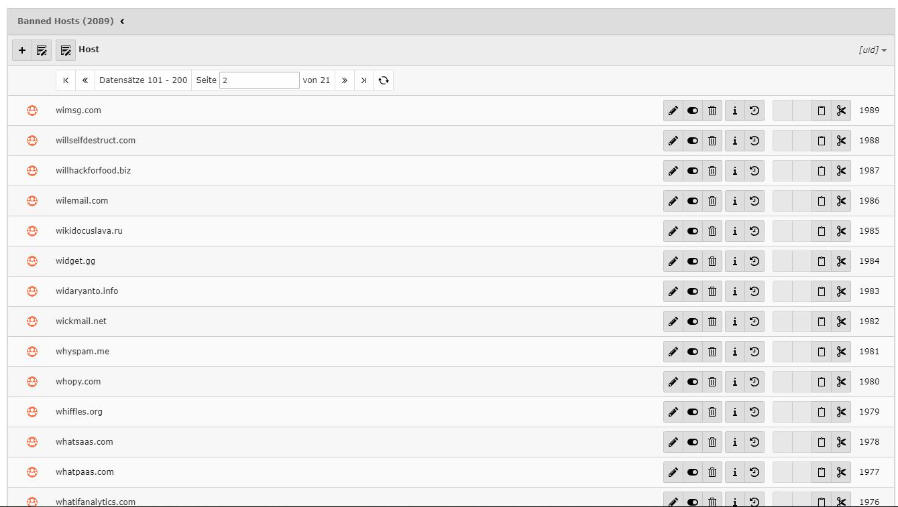

## Installation

### Preparation: Include static TypoScript
The extension ships some TypoScript code which needs to be included.

* Switch to the root page of your site.
* Switch to the Template module and select Info/Modify.
* Press the link Edit the whole template record and switch to the tab Includes.
* Select "Users (users)" at the field Include static (from extensions)

### Use the plugins

* Go to any page
* Click on "add content element"
* Switch to the tab "Users"
* Choose a plugin (login, register, ...) and insert it
* Edit the plugin (pencil)
* Edit the settings in the "plugin" tab (see the screenshots here in the documentation)
* Thats it and that's how every "users" plugin works
* No further typoscript

## Important notes

* Very important: Do NOT activate "allow login with email adress" if your system allows usernames with email adresses. The register plugin of this users extension will not allow email adresses as usernames.

## Screenshots Backend PLugins

### Plugin: Login

General settings
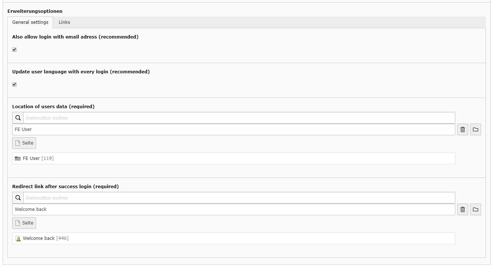

Links
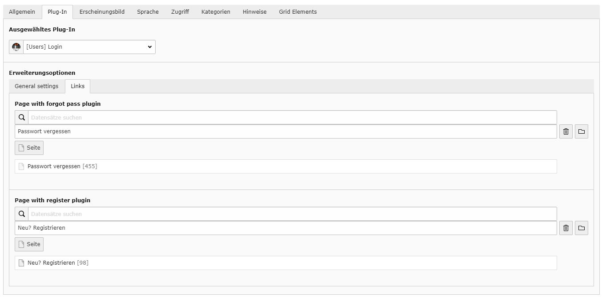

### Plugin: Logout

General settings
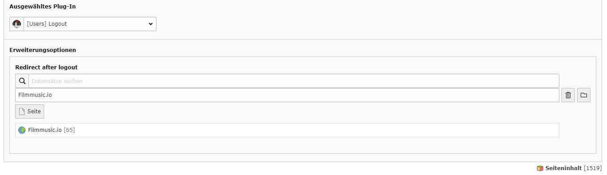

### Plugin: Forgot password

General settings
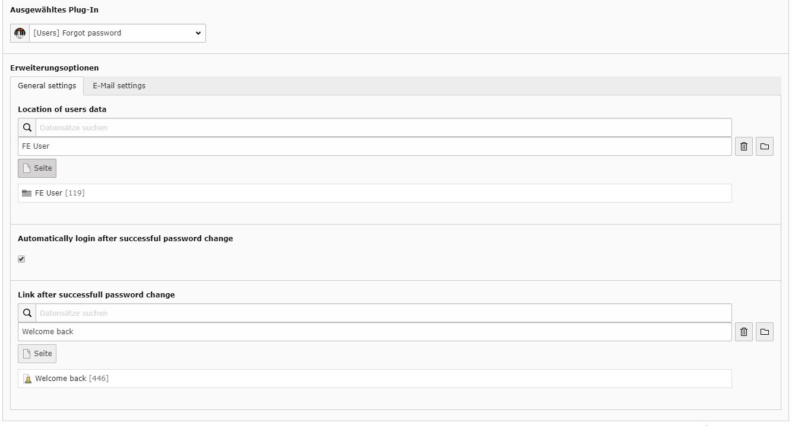

Email settings
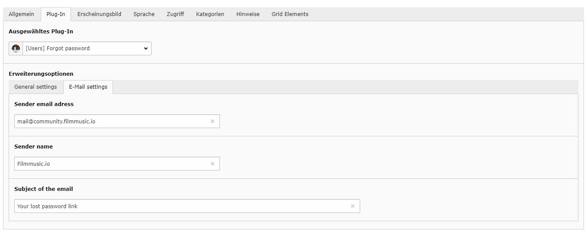

### Plugin: Register

General settings
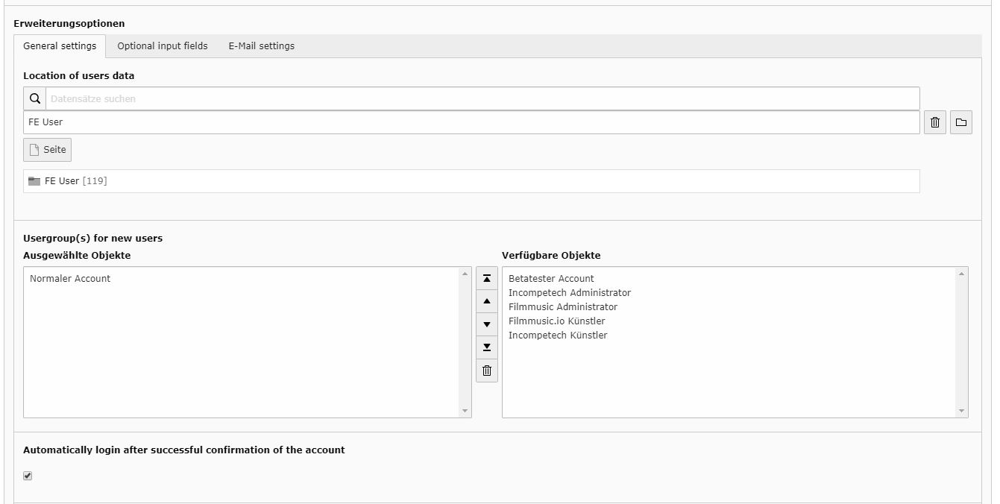

Field settings
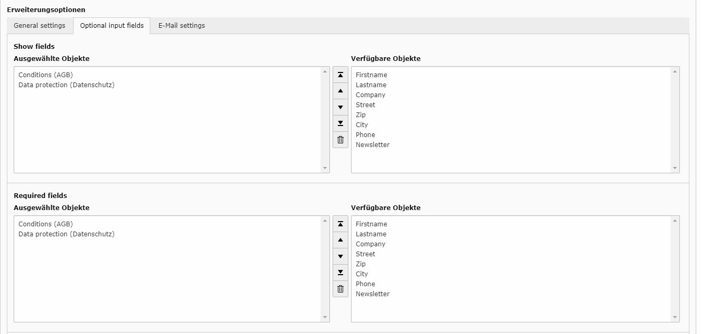
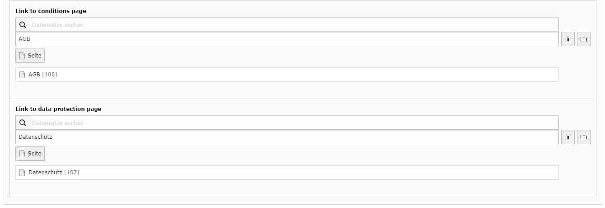

Email settings
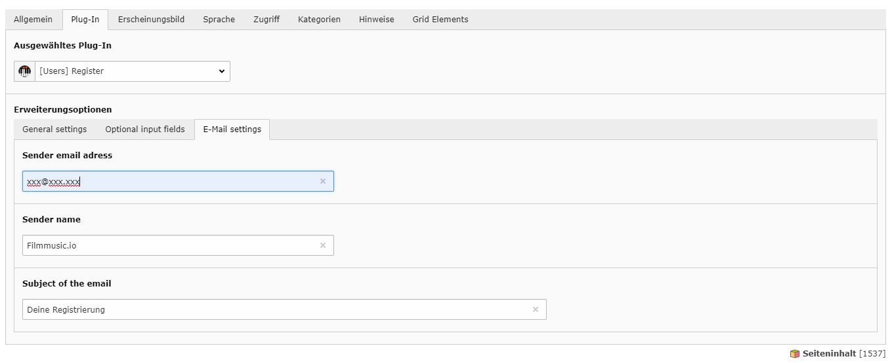